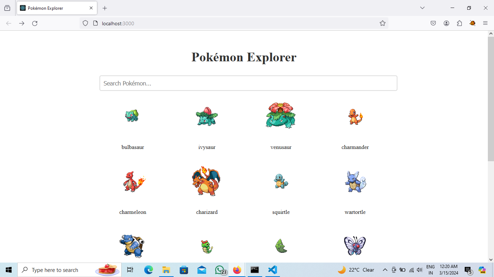
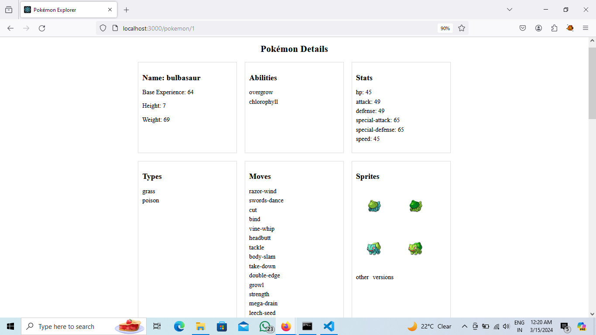

# Pokémon Explorer App

Welcome to the Pokémon Explorer App! This application allows you to explore various Pokémon, view their details, and search for specific Pokémon by name.

## How to Run

1. Clone the repository:
## git clone : https://github.com/rohan7745/pokemon-explorer-app.git
-----------------------------------------------------------
2. Navigate to the project directory: 

## cd pokemon-explorer-app

------------------------------------------------------------
3. Install dependencies:
## npm install
## axios 
## react-router-dom

-------------------------------------------------------------

4. Start the development server:

## npm start

--------------------------------------------------------------

5. Open your web browser and go to `http://localhost:3000` to view the app.

## Screenshots

### Home Page

### Pokémon Details Page

## Features

- View a list of Pokémon on the home page.
- Search for Pokémon by name.

## Technologies Used

- React
- Axios
- React Router